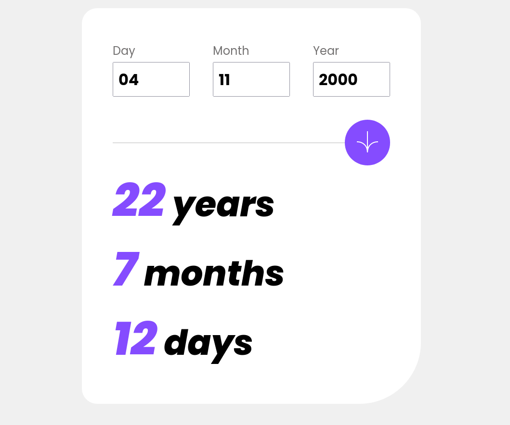
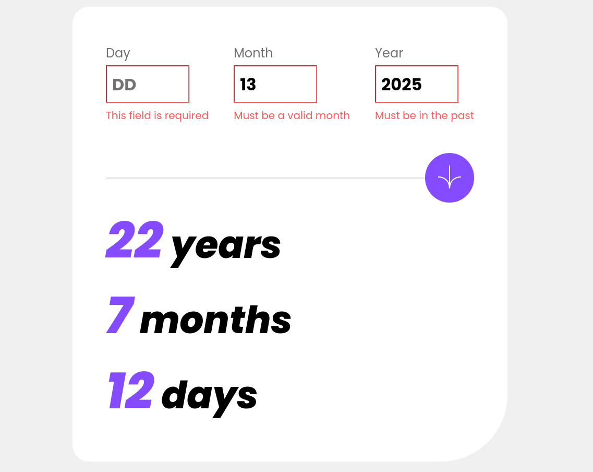
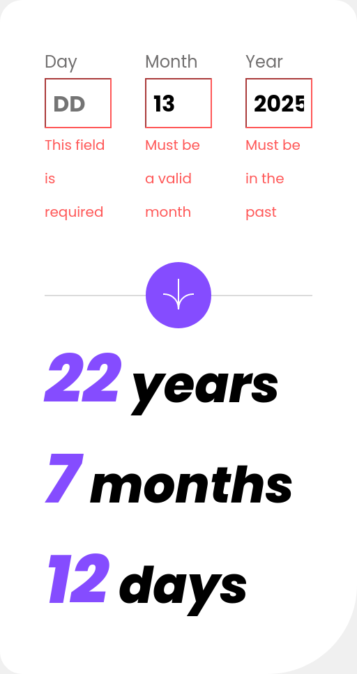

# Frontend Mentor - Age calculator app solution

This is a solution to the [Age calculator app challenge on Frontend Mentor](https://www.frontendmentor.io/challenges/age-calculator-app-dF9DFFpj-Q). Frontend Mentor challenges help you improve your coding skills by building realistic projects. 

## Table of contents

- [Overview](#overview)
  - [The challenge](#the-challenge)
  - [Screenshot](#screenshot)
  - [Links](#links)
- [My process](#my-process)
  - [Built with](#built-with)
  - [Useful resources](#useful-resources)
- [Author](#author)
- [Acknowledgments](#acknowledgments)

**Note: Delete this note and update the table of contents based on what sections you keep.**

## Overview

### The challenge

Users should be able to:

- View an age in years, months, and days after submitting a valid date through the form
- Receive validation errors if:
  - Any field is empty when the form is submitted
  - The day number is not between 1-31
  - The month number is not between 1-12
  - The year is in the future
  - The date is invalid e.g. 31/04/1991 (there are 30 days in April)
- View the optimal layout for the interface depending on their device's screen size
- See hover and focus states for all interactive elements on the page
- **Bonus**: See the age numbers animate to their final number when the form is submitted (didnt do this)

### Screenshot

### Links

- Github repo: [Add solution URL here](https://github.com/DrZero1234/Fem_age_calculator)
- Live Site URL: [Add live site URL here](https://drzero1234.github.io/Fem_age_calculator/)

## My process

### Built with

- Semantic HTML5 markup
- CSS custom properties
- Flexbox
- CSS Grid
- Vanila Javascript

### Useful resources

- [HTML Forms](https://developer.mozilla.org/en-US/docs/Learn/Forms) - The official docs for basic html forms
- [Age calculator](https://www.tutorialstonight.com/age-calculator-in-javascript) - The code for calculating the difference between now and input date in YYYY-MM-DD format.
- [Media Query in Javascript](https://css-tricks.com/working-with-javascript-media-queries/) - This helped me understand how to set media query in JS

## Author

- Frontend Mentor - [@DrZero1234](https://www.frontendmentor.io/profile/DrZero1234)
- Github - [@yourusername](https://www.twitter.com/yourusername)

